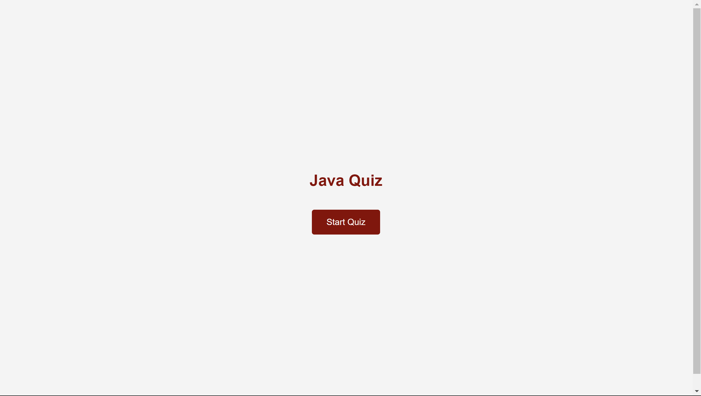
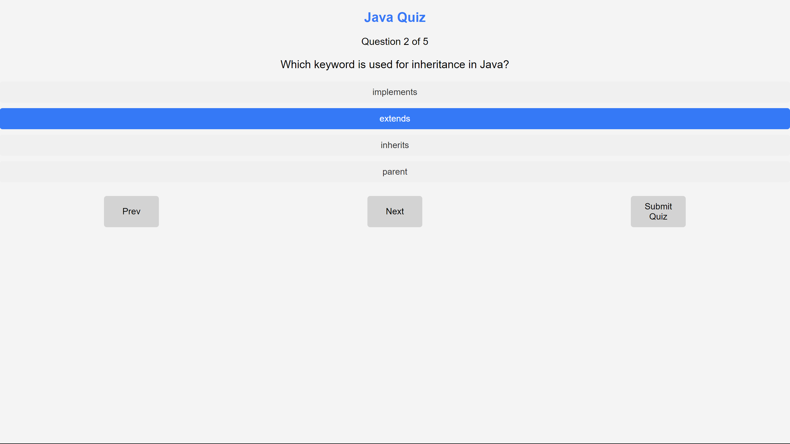
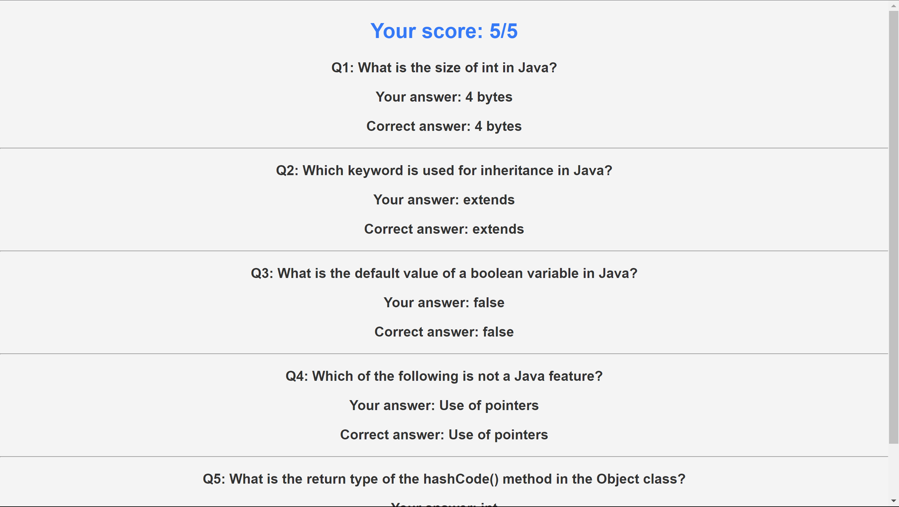

# quiz application
 This is a simple quiz application with a focus on Java programming questions. The user can navigate through questions, select answers, and submit the quiz to see their final score along with a review of their answers and the correct options.
# Features
Start the Quiz: The quiz starts when the user clicks the "Start Quiz" button.
Question Navigation: Users can navigate through the questions using "Prev" and "Next" buttons.
Submit Quiz: Upon completing all the questions, users can submit the quiz to see their score and review their answers.
Review Section: After submission, the user sees a detailed summary of the selected answers along with the correct answers.
# Project Structure
.
├── Quizze.html        # Main HTML file
├── styles.css        # CSS file for styling
└── script.js           # JavaScript file for quiz logic
# Getting Started
Follow the instructions below to get the project running on your local machine.
# Prerequisites
You need a web browser to run this application.
# Installation
1. Clone the Repository
git clone https://github.com/DKk2/quiz-application.git
2. Navigate into the project directory
cd quiz-application
3. Open Quizze.html in a web browser to run the quiz application.
You can either double-click the Quizzze.html file or open it in a browser by using:
open Quizze.html     # for MacOS
start Quizze.html    # for Windows
# How to Play
1. Start the quiz by clicking the "Start Quiz" button.
2. Navigate through the questions using the Prev and Next buttons.
3. Select an option for each question by clicking on the available options.
4. Once you have answered all the questions, click Submit Quiz to view your score.
5. After submission, you can review your selected answers and compare them with the correct answers.
# Technologies Used
* HTML5
* CSS3
* JavaScript
# Screenshots
* Quiz Start Page

* Quiz in Progress

* Quiz Results

